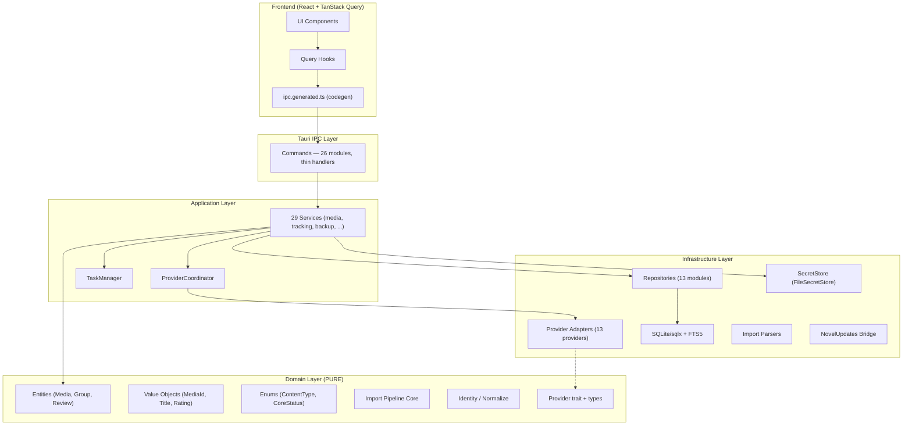

# MyLore — Comprehensive Engineering Audit Report

> **Auditor Role**: Principal Software Architect / Staff Engineer / Security & Performance Engineer
> **Date**: 2026-10-07
> **Codebase Version**: `0.1.1-alpha.4`
> **Methodology**: Code-first evidence-based analysis per the 60-point Audit Protocol

---

## A. Executive Summary

| Dimension | Score |
|---|---|
| **Overall Health** | **78 / 100** |
| Architecture | 85 |
| Code Quality | 82 |
| Security | 72 |
| Performance | 75 |
| Testing | 70 |
| Maintainability | 80 |
| UX Architecture | 76 |

**Verdict**: MyLore is a well-architected, impressively disciplined project for its maturity stage. The layered architecture (commands → application → domain ← infrastructure) is **genuinely implemented** and not just documented. The domain layer is truly pure. The provider abstraction is one of the strongest subsystems. The primary risks are in the security of secrets at rest, some large service files approaching god-object territory, and testing gaps in the P2P/E2EE and backup/restore critical paths.

### Top 10 Findings

| # | ID | Severity | Finding |
|---|---|---|---|
| 1 | SEC-001 | **Critical** | API keys stored as **plaintext JSON** on disk (`api_keys.json`) |
| 2 | SEC-002 | **High** | `db_get_passphrase` IPC command exposes raw DB passphrase to webview |
| 3 | ARCH-001 | **High** | Several application services exceed 1,000 lines, approaching god-object territory |
| 4 | DB-001 | **High** | Migration 0013 uses `PRAGMA writable_schema` with string replacement — brittle |
| 5 | TEST-001 | **High** | No adversarial/security tests for the P2P/E2EE engine |
| 6 | SEC-003 | **Medium** | `VACUUM INTO` path interpolation (backup service) — controlled but lacks parameterization |
| 7 | PERF-001 | **Medium** | `MediaService` created fresh on every IPC call — no pooling of service instances |
| 8 | IPC-001 | **Medium** | `media_create` has 13 positional parameters instead of a struct |
| 9 | TEST-002 | **Medium** | No restore-crash recovery tests (backup service) |
| 10 | ARCH-002 | **Medium** | `content_type` CHECK enum is duplicated across migration SQL, Rust domain, and IPC contract |

---

## B. Architecture Verdict

```
Is the architecture fundamentally sound?   → YES
Is a rewrite justified?                    → NO
Is major refactoring justified?            → NO
Is incremental improvement sufficient?     → YES
```

**Reasoning**: The documented 4-layer architecture (Presentation → Commands → Application → Domain ← Infrastructure) is **faithfully implemented**. The domain layer has zero imports of `sqlx`, `reqwest`, `tokio`, or `tauri`. Commands are genuinely thin. The provider abstraction is clean and extensible. The IPC contract is code-generated from a single JSON source of truth. This is well above average for a project at this stage. The issues found are refinements, not structural failures.

---

## C. Architecture Map

### Actual Architecture (as found)



### Proposed Adjustments

No major structural changes needed. Incremental improvements:
1. Extract large services into focused use-case modules
2. Add struct-based IPC inputs for commands with 5+ parameters
3. Move secret storage to OS-level encryption when stable

---

## D. Architecture Violations

| ID | Layer | Violation | Severity | Recommendation |
|---|---|---|---|---|
| AV-001 | Commands → Infrastructure | `media_facets` return type is `infrastructure::repositories::media::MediaFacets` exposed directly through the command | Low | Create an application-layer DTO |
| AV-002 | Commands → Infrastructure | `media_get` returns `infrastructure::repositories::media::MediaRecord` | Low | Same — application-layer DTO |
| AV-003 | Commands → Infrastructure | `media_tags` returns `infrastructure::repositories::media::TagLink` | Low | Same pattern |
| AV-004 | Application | `Placeholder` struct in `application::mod.rs` line 39 — dead code | Info | Remove |
| AV-005 | Infrastructure | `Placeholder` struct in `infrastructure::mod.rs` line 23 — dead code | Info | Remove |

> [!NOTE]
> AV-001 through AV-003 are minor: the repository DTOs **are** the serialization shapes and contain no infrastructure secrets. Creating separate application DTOs would add ceremony without behavior change. These are intentional pragmatic shortcuts, not architectural leaks. Worth documenting as ADR-accepted deviations rather than fixing immediately.

---

## E. Security Findings

| ID | Severity | Finding | Location | Recommendation |
|---|---|---|---|---|
| SEC-001 | **Critical** | API keys + DB passphrase stored as **plaintext JSON** (`api_keys.json`). Any process with read access to AppData can extract them. | [keyring.rs](file:///c:/Users/malek/project/MyLore/src-tauri/src/infrastructure/keyring.rs) | Phase 1: encrypt the JSON with a DPAPI-derived key (Windows) or keychain (macOS). Phase 0: document the threat model explicitly. |
| SEC-002 | **High** | `db_get_passphrase` IPC command returns the raw SQLCipher passphrase to the frontend webview. A malicious frontend extension or XSS could exfiltrate it. | [db_security.rs:177](file:///c:/Users/malek/project/MyLore/src-tauri/src/commands/db_security.rs#L177) | Remove the command; implement clipboard copy in Rust directly. |
| SEC-003 | **Medium** | `VACUUM INTO` path is service-controlled string interpolation, not parameterized. Safe today because the path comes from `data_dir`, but fragile. | [backup_service.rs:272](file:///c:/Users/malek/project/MyLore/src-tauri/src/application/backup_service.rs#L272) | Document as accepted risk; SQLite's `VACUUM INTO` does not accept bound parameters. |
| SEC-004 | **Medium** | CSP `img-src` allows 12+ external domains. Each is an exfiltration vector if any content is rendered in those image URLs. | [tauri.conf.json:30](file:///c:/Users/malek/project/MyLore/src-tauri/tauri.conf.json#L30) | Acceptable — these are the provider cover image CDNs. Verify no `data:` is needed for SVG inline. |
| SEC-005 | **Medium** | `nu-fetch` capability grants `core:default` to a remote NovelUpdates origin. The IPC commands available to this window are not restricted to just the bridge command. | [nu-fetch.json](file:///c:/Users/malek/project/MyLore/src-tauri/capabilities/nu-fetch.json) | Restrict permissions to only the `nu_clearance_report` command. |
| SEC-006 | **Low** | `FileSecretStore::flush` writes the JSON non-atomically (no temp file + rename). A crash during write corrupts the file. | [keyring.rs:57](file:///c:/Users/malek/project/MyLore/src-tauri/src/infrastructure/keyring.rs#L57) | Write to temp file, then rename. |
| SEC-007 | **Low** | `validate_ipc_path` rejects relative paths but does not resolve symlinks or check that the path is within expected directories. | [db.rs:72](file:///c:/Users/malek/project/MyLore/src-tauri/src/infrastructure/db.rs#L72) | Defense-in-depth is present (file dialog produces paths); monitor for use in new commands. |

---

## F. Performance Findings

| ID | Severity | Finding | Location | Recommendation |
|---|---|---|---|---|
| PERF-001 | **Medium** | `MediaService::new(pool.clone())` is called on every IPC invocation. The service is stateless and the clone is cheap (Arc), but if services grow state, this becomes a problem. | [media.rs:37](file:///c:/Users/malek/project/MyLore/src-tauri/src/commands/media.rs#L37) | Acceptable for now — `SqlitePool::clone` is an Arc bump. Monitor. |
| PERF-002 | **Medium** | `media_list` constructs dynamic SQL with `QueryBuilder` on every call. For the hot path (library grid), a pre-built query might be faster. | infrastructure/repositories/media.rs | Measure before optimizing. |
| PERF-003 | **Low** | FTS `normalize_query` runs per-character fold on every search keystroke. For large queries this is fine; for autocomplete it might need caching. | [fts.rs:20](file:///c:/Users/malek/project/MyLore/src-tauri/src/infrastructure/fts.rs#L20) | No action needed — the fold is O(n) on query length. |
| PERF-004 | **Low** | Startup `block_on` for DB connect, integrity check, and migration runs sequentially. For large databases, startup may feel slow. | [lib.rs:74-93](file:///c:/Users/malek/project/MyLore/src-tauri/src/lib.rs#L74-L93) | The code already logs timing. Acceptable until measured data shows a problem. |
| PERF-005 | **Low** | `backup_service.create()` loads all asset rows into memory to build the manifest. For very large libraries (10k+ cached images), this could be significant. | [backup_service.rs:281-286](file:///c:/Users/malek/project/MyLore/src-tauri/src/application/backup_service.rs#L281-L286) | Stream with `fetch()` instead of `fetch_all()` when the library grows past ~5k assets. |

---

## G. Database Findings

| ID | Severity | Finding | Location | Recommendation |
|---|---|---|---|---|
| DB-001 | **High** | Migration 0013 uses `PRAGMA writable_schema = ON` + `REPLACE` on `sqlite_master.sql` to widen a CHECK constraint. If the original CHECK text ever changes (whitespace, ordering), the `REPLACE` silently fails to match, leaving the constraint unchanged. | [0013_new_content_types.sql](file:///c:/Users/malek/project/MyLore/src-tauri/migrations/0013_new_content_types.sql) | Already shipped; add a post-migration verification query (line 30-33 exists but only counts, doesn't fail). Future CHECK changes should use table rebuild. |
| DB-002 | **Medium** | 18 migrations, sequential numbering, no rollback support. sqlx does not support down migrations natively. Pre-migration backups (MISSION-087) compensate, but a failed migration leaves a half-migrated schema. | migrations/ | Acceptable given the pre-migration backup. Document that rollback = restore from backup. |
| DB-003 | **Low** | `node_progress` table has no index on `read_at` — future calendar/timeline queries on read dates will be slow. | [0005_tracking.sql](file:///c:/Users/malek/project/MyLore/src-tauri/migrations/0005_tracking.sql) | Add index when calendar features use `read_at`. |
| DB-004 | **Low** | `tracking` table uses a string-based CHECK for `core_status` — consistent with the domain enum `as_str()` values. Good alignment. | Keep as-is | ✅ Well done. |
| DB-005 | **Info** | WAL mode + `synchronous=NORMAL` + 5s busy timeout — excellent choices for a desktop SQLite app. | [db.rs:42-48](file:///c:/Users/malek/project/MyLore/src-tauri/src/infrastructure/db.rs#L42-L48) | ✅ Keep as-is. |

---

## H. Rust Findings

| ID | Severity | Finding | Location | Recommendation |
|---|---|---|---|---|
| RS-001 | **Medium** | `backup_service.rs` is 1,641 lines. Contains create, validate, restore, pre-migration backup, auto-backup, prefs, listing, deletion — too many responsibilities. | [backup_service.rs](file:///c:/Users/malek/project/MyLore/src-tauri/src/application/backup_service.rs) | Split into `BackupCreator`, `BackupValidator`, `RestoreService`, `BackupPrefs`. |
| RS-002 | **Medium** | `reading_group_p2p.rs` is 1,741 lines. The E2EE + CRDT engine is complex and warrants sub-modules. | [reading_group_p2p.rs](file:///c:/Users/malek/project/MyLore/src-tauri/src/application/reading_group_p2p.rs) | Split into `crypto.rs`, `crdt.rs`, `invite.rs`. |
| RS-003 | **Medium** | `coordinator.rs` is 1,155 lines — but 650+ are tests. The production code is ~500 lines, which is acceptable. | [coordinator.rs](file:///c:/Users/malek/project/MyLore/src-tauri/src/application/providers/coordinator.rs) | ✅ Keep as-is. Tests co-located is good. |
| RS-004 | **Low** | `media.rs` (repository) is 1,739 lines. The query complexity is inherent to the aggregate. | [repositories/media.rs](file:///c:/Users/malek/project/MyLore/src-tauri/src/infrastructure/repositories/media.rs) | Monitor; extracting sub-queries into private functions would help readability. |
| RS-005 | **Low** | `import.rs` (domain) is 1,200 lines — but this is the import pipeline core with extensive validation. The complexity is justified. | [domain/import.rs](file:///c:/Users/malek/project/MyLore/src-tauri/src/domain/import.rs) | ✅ Keep as-is. |
| RS-006 | **Info** | No `TODO`, `FIXME`, or `HACK` markers in the entire Rust codebase. | src-tauri/src/ | ✅ Excellent hygiene. |
| RS-007 | **Info** | All `unwrap()` calls in non-test Rust code are in `PoisonError::into_inner` recovery patterns — a deliberate, documented choice. | Various | ✅ Good practice. |

---

## I. React / TypeScript Findings

| ID | Severity | Finding | Location | Recommendation |
|---|---|---|---|---|
| TS-001 | **Low** | No Zustand stores found — all domain state flows through TanStack Query. This is excellent for a Tauri app where the backend is the source of truth. | src/ | ✅ Keep as-is. |
| TS-002 | **Low** | `ipc.generated.ts` is 1,360 lines (auto-generated). The code-gen approach from `ipc-contract.json` is sound. | [ipc.generated.ts](file:///c:/Users/malek/project/MyLore/src/api/ipc.generated.ts) | ✅ Keep as-is. The `codegen:check` CI step ensures it stays in sync. |
| TS-003 | **Low** | `locales.ts` is 106KB — a single file with all locale strings. For two languages (en/ar) this is manageable but will grow. | [locales.ts](file:///c:/Users/malek/project/MyLore/src/i18n/locales.ts) | Consider splitting into per-locale files when a third language is added. |
| TS-004 | **Info** | Query key factory (`queryKeys.ts`) is well-structured with proper scoping and fan-out patterns. Invalidation chains look correct. | [queryKeys.ts](file:///c:/Users/malek/project/MyLore/src/api/queryKeys.ts) | ✅ Keep as-is. |
| TS-005 | **Info** | Optimistic updates in `useNodeProgress` with proper rollback — well implemented. | [library/api.ts:258-298](file:///c:/Users/malek/project/MyLore/src/features/library/api.ts#L258-L298) | ✅ Keep as-is. |
| TS-006 | **Info** | No direct `invoke()` calls found outside `ipc.generated.ts` — all IPC goes through the generated layer. | src/ | ✅ Excellent discipline. |

---

## J. Tauri / IPC Findings

| ID | Severity | Finding | Location | Recommendation |
|---|---|---|---|---|
| IPC-001 | **Medium** | `media_create` has 13 positional parameters. Tauri 2 commands support struct arguments. | [commands/media.rs:20-54](file:///c:/Users/malek/project/MyLore/src-tauri/src/commands/media.rs#L20-L54) | Migrate to `#[command] async fn media_create(input: AddMediaInput)`. |
| IPC-002 | **Medium** | `media_list` has 12 positional parameters. Same issue. | [commands/media.rs:61-93](file:///c:/Users/malek/project/MyLore/src-tauri/src/commands/media.rs#L61-L93) | Same fix — struct argument. |
| IPC-003 | **Low** | 110 IPC commands registered in `invoke_handler`. This is a large surface but each command is thin and well-typed. | [lib.rs:222-332](file:///c:/Users/malek/project/MyLore/src-tauri/src/lib.rs#L222-L332) | Acceptable at this scale. |
| IPC-004 | **Low** | `withGlobalTauri: true` in `tauri.conf.json` — exposes the Tauri API globally. Acceptable for a desktop app but reduces isolation. | [tauri.conf.json:13](file:///c:/Users/malek/project/MyLore/src-tauri/tauri.conf.json#L13) | Monitor; consider disabling when the IPC layer is stable. |
| IPC-005 | **Info** | Commands log invocation with `tracing::info!` — provides good observability. | Various commands | ✅ Keep as-is. |

---

## K. Provider Findings

| ID | Severity | Finding | Location | Recommendation |
|---|---|---|---|---|
| PROV-001 | **Info** | 13 provider adapters implemented, each in its own module. All implement the `Provider` trait. | infrastructure/providers/ | ✅ Excellent structure. |
| PROV-002 | **Info** | Provider error model (`ProviderError`) has proper retryability classification and `retry_after` support. | [domain/provider/error.rs](file:///c:/Users/malek/project/MyLore/src-tauri/src/domain/provider/error.rs) | ✅ One of the strongest subsystems. |
| PROV-003 | **Info** | `search_all` properly isolates provider failures — one failing provider never kills the whole search. | [coordinator.rs:302-381](file:///c:/Users/malek/project/MyLore/src-tauri/src/application/providers/coordinator.rs#L302-L381) | ✅ Keep as-is. |
| PROV-004 | **Info** | Rate limiter uses token-bucket-by-spacing with poison recovery. Deterministically testable. | [rate_limiter.rs](file:///c:/Users/malek/project/MyLore/src-tauri/src/application/providers/rate_limiter.rs) | ✅ Keep as-is. |
| PROV-005 | **Low** | NovelUpdates bridge uses a hidden webview — a creative solution for HttpOnly cookie clearance, but adds complexity. | [nu_bridge.rs](file:///c:/Users/malek/project/MyLore/src-tauri/src/infrastructure/nu_bridge.rs), [lib.rs:154-203](file:///c:/Users/malek/project/MyLore/src-tauri/src/lib.rs#L154-L203) | Document clearly as a known trade-off. Monitor for WebView2 lifecycle issues. |

---

## L. Testing Gaps

| Area | Existing Coverage | Risk | Missing Tests | Priority |
|---|---|---|---|---|
| Domain (entities, VOs, enums) | ✅ Good — unit tests with invariant checks | Low | Edge cases for Unicode normalization with mixed-script titles | Low |
| Provider adapters | ✅ Fixture-based tests with wiremock | Low | Malformed JSON response fixtures | Medium |
| Provider coordinator | ✅ Excellent — paused-time, fake adapters, cancellation | Low | None critical | — |
| Import pipeline | ✅ Domain tests + integration tests | Medium | Malformed/huge file fixtures, partial failure recovery | Medium |
| Backup/Restore | ✅ Integration tests exist | **High** | **No restore-crash recovery tests** (what happens if app dies mid-restore?) | **High** |
| P2P/E2EE | ⚠️ Unit tests for crypto primitives | **High** | **No adversarial tests** (malicious envelope, replay, stale key, compromised relay) | **Critical** |
| React/UI | ⚠️ Basic component tests | Medium | Accessibility tests, RTL layout tests | Medium |
| E2E (Playwright) | ⚠️ 1 spec file, 2 files total | **High** | Real user flow E2E tests (add → track → search → backup → restore) | High |
| Database benchmarks | ✅ Criterion bench for DB ops | Low | Large-scale (100k+ rows) benchmarks | Low |
| CI | ✅ Multi-platform (Ubuntu, macOS, Windows) | Low | `p2p` feature is not tested in CI (`cargo test` runs without `--features p2p`) | Medium |

---

## M. UX / Accessibility Findings

| ID | Category | Severity | Finding | Recommendation |
|---|---|---|---|---|
| UX-001 | i18n | **Info** | Two locales (en, ar) in a single `locales.ts` file — functional but large | Split into per-locale files at 3+ languages |
| UX-002 | RTL | **Low** | RTL support is designed into the i18n layer; actual CSS `dir` and logical properties need UI-level verification | Add visual regression tests for RTL |
| UX-003 | Accessibility | **Low** | Radix UI primitives are used (dialog, popover, toast, label) — good baseline | Verify keyboard trap and screen reader behavior in dialogs |
| UX-004 | UX | **Low** | Fatal startup error shows a native dialog — good UX for a non-recoverable error | ✅ Keep as-is |
| UX-005 | UX | **Info** | Recovery mode for corrupt database (launches UI so user can restore) — thoughtful | ✅ Keep as-is |

---

## N. Technical Debt

### Critical Debt
- **SEC-001**: Plaintext secret storage — must be addressed before production

### High Debt
- **SEC-002**: Passphrase exposed to webview
- **RS-001**: `backup_service.rs` at 1,641 lines
- **RS-002**: `reading_group_p2p.rs` at 1,741 lines
- **TEST-001**: No adversarial P2P/E2EE tests
- **TEST-002**: No restore-crash recovery tests

### Medium Debt
- **IPC-001/002**: Positional parameter sprawl in commands
- **DB-001**: Brittle `writable_schema` migration
- **ARCH-002**: Content type enum duplicated across three layers
- **TS-003**: Locale file will grow linearly with languages
- **SEC-005**: NovelUpdates bridge window has overly broad permissions

### Low Debt
- **AV-001/002/003**: Repository DTOs exposed through commands (pragmatic, documented)
- **RS-004**: Large repository file (inherent complexity)
- **SEC-006**: Non-atomic secret store writes

---

## O. What NOT to Change (Keep As-Is)

> [!IMPORTANT]
> These subsystems are well-designed and should not be refactored:

| Component | Why Keep It |
|---|---|
| **Domain layer purity** | Zero infrastructure dependencies. Genuinely pure. |
| **`string_enum!` macro** | Clean, DRY, aligned with SQL CHECK constraints, tested. |
| **Value objects** (`MediaId`, `Title`, `Rating`, `DateOnly`) | Proper invariant enforcement, immutable, well-tested. |
| **Provider trait + capabilities model** | Clean abstraction, extensible, well-documented. |
| **ProviderError with retryability** | Excellent typed error model with proper retry classification. |
| **ProviderCoordinator policy loop** | Cancellation, backoff, rate limiting, partial failure isolation — all correct. |
| **RateLimiter** | Simple, testable, poison-recovering. |
| **CancellationToken** | Cooperative, clone-safe, `Notify`-based — correct. |
| **IPC codegen pipeline** | `ipc-contract.json` → `codegen-ipc.mjs` → `ipc.generated.ts` — type-safe by design. |
| **Query key factory** | Well-structured, proper fan-out, single source of truth. |
| **Error hierarchy** (`DomainError` → `AppError` → IPC string) | Clean, layered, no sensitive data leakage. |
| **Pre-migration backup** | Safety net that justifies not having rollback migrations. |
| **Panic hook + fatal startup error** | Thorough — log + stderr + dialog + exit. |
| **Logging** (rolling daily, max 5 files, non-blocking, flushable) | Production-quality. |
| **FTS5 dual-index** (unicode61 + trigram for CJK) | Correct for the multi-script search requirements. |
| **Title normalization** | Script-aware (CJK, kana voicing, Arabic), well-tested. |
| **Identity matching** (exact external ID → title exact → fuzzy) | Principled approach with proper scoring tiers. |
| **CI pipeline** | Multi-platform, fmt + clippy + test + lint + codegen check + build. |
| **Feature flags** (`p2p`, `db-encryption`) | Clean conditional compilation, stubs when disabled. |

---

## P. Uncertainty Register

| Unknown | Why it matters | Evidence missing | How to verify |
|---|---|---|---|
| P2P E2EE security guarantees | The E2EE code uses XChaCha20-Poly1305 and yrs CRDT — the crypto primitives are sound, but the composition (envelope format, nonce handling, AAD, replay protection) has not been independently verified. | No security audit of the crypto composition | Commission a focused crypto review of `reading_group_p2p.rs` |
| Import pipeline behavior with >100k rows | The pipeline uses batched transactions, but memory usage during large imports is unclear. | No large-scale import benchmarks | Run import with 100k-row synthetic CSV and profile memory |
| Backup/restore behavior under Windows file locking | The code includes a 200ms sleep after pool close to avoid `ERROR_SHARING_VIOLATION`. This is a heuristic, not a guarantee. | No CI test on Windows with active WAL | Test manually on Windows with a large WAL |
| NovelUpdates bridge stability | The hidden webview approach depends on WebView2 lifecycle specifics. Long-running sessions may encounter GC or suspension. | No long-session stability tests | Monitor user reports post-launch |

---

## Q. Prioritized Roadmap

### Phase 0 — Immediate Risk (before any new features)

| ID | Task | Files | Risk | Effort | Priority |
|---|---|---|---|---|---|
| P0-1 | Encrypt `api_keys.json` with OS-level API (DPAPI/Keychain) | `infrastructure/keyring.rs` | High | 3-5 days | P0 |
| P0-2 | Remove or restrict `db_get_passphrase` command | `commands/db_security.rs` | High | 1 day | P0 |
| P0-3 | Restrict `nu-fetch` capability to only bridge commands | `capabilities/nu-fetch.json` | Medium | 0.5 day | P0 |
| P0-4 | Add `p2p` feature to CI test matrix | `.github/workflows/ci.yml` | Medium | 0.5 day | P0 |

**Acceptance Criteria for Phase 0**:
- No provider API key or DB passphrase is readable by any process that can read `AppData`
- The webview cannot retrieve the raw DB passphrase
- The NovelUpdates bridge window cannot invoke any command other than its bridge report
- P2P code is compiled and tested on every CI run

### Phase 1 — High-Impact Engineering

| ID | Task | Files | Risk | Effort | Priority |
|---|---|---|---|---|---|
| P1-1 | Split `backup_service.rs` into focused modules | `application/backup_service.rs` | Low | 2-3 days | P1 |
| P1-2 | Add restore-crash recovery tests | `tests/backup_restore.rs` | Medium | 2 days | P1 |
| P1-3 | Add adversarial P2P/E2EE tests (replay, stale key, malformed envelope) | `tests/`, `application/reading_group_p2p.rs` | Medium | 3-5 days | P1 |
| P1-4 | Migrate positional command params to struct args | `commands/media.rs`, others | Low | 2 days | P1 |
| P1-5 | Atomic secret store writes (temp + rename) | `infrastructure/keyring.rs` | Low | 0.5 day | P1 |
| P1-6 | Add real E2E test flows (add → track → search → backup → restore) | `e2e/` | Medium | 3-5 days | P1 |

### Phase 2 — Structural Improvements

| ID | Task | Files | Risk | Effort | Priority |
|---|---|---|---|---|---|
| P2-1 | Extract `reading_group_p2p.rs` into sub-modules (`crypto`, `crdt`, `invite`) | `application/reading_group_p2p.rs` | Low | 2 days | P2 |
| P2-2 | Create application-layer DTOs for commands that return repository types | `commands/media.rs` | Low | 1 day | P2 |
| P2-3 | Add accessibility tests (keyboard navigation, screen reader) | `src/test/` | Low | 2-3 days | P2 |
| P2-4 | Add RTL visual regression tests | `e2e/` or visual testing tool | Low | 2 days | P2 |
| P2-5 | Document remaining ADRs for intentional deviations | `PROJECTMAP/DECISIONS.md` | Low | 1 day | P2 |

### Phase 3 — Long-Term Improvements

| ID | Task | Files | Risk | Effort | Priority |
|---|---|---|---|---|---|
| P3-1 | Split `locales.ts` into per-locale files | `src/i18n/` | Low | 1 day | P3 |
| P3-2 | Add large-scale import benchmarks (100k rows) | `benches/` | Low | 1-2 days | P3 |
| P3-3 | Streaming asset manifest for backup (avoid loading all rows) | `application/backup_service.rs` | Low | 1 day | P3 |
| P3-4 | Verify `writable_schema` migration correctness on real user databases | Manual testing | Low | 0.5 day | P3 |

---

## R. Architectural Drift Audit

| Architecture Rule | Implementation | Compliant? | Evidence |
|---|---|---|---|
| Domain is pure (no SQL, no I/O, no framework) | ✅ Zero imports of sqlx/reqwest/tokio/tauri in domain | **Yes** | grep search confirmed |
| Commands are thin IPC handlers | ✅ Commands delegate to services, carry no logic | **Yes** | All 26 command modules reviewed |
| Infrastructure depends on domain, not vice versa | ✅ Infrastructure imports domain types; domain imports nothing from infra | **Yes** | Module structure verified |
| Provider adapters normalize to domain types | ✅ `ProviderMedia`, `ProviderCandidate` are domain types | **Yes** | `domain/provider/types.rs` |
| IPC contract is code-generated | ✅ `ipc-contract.json` → `codegen-ipc.mjs` → `ipc.generated.ts` | **Yes** | CI `codegen:check` enforces |
| TanStack Query is the single source of domain state | ✅ No Zustand stores for domain data | **Yes** | grep search confirmed |
| Error flow: Domain → App → IPC → TS | ✅ `DomainError` → `AppError` → serialized string | **Yes** | `error.rs` chain verified |
| Provider failure isolation | ✅ `search_all` collects per-provider failures | **Yes** | `coordinator.rs` reviewed |
| Pre-migration safety backup | ✅ Runs before every schema migration | **Yes** | `lib.rs:63-72` |

**Documentation Drift**: Minor. `application::mod.rs` (line 3-6) references milestones M6-M11 as future — these have landed. The doc comment is stale but harmless.

---

## S. Privacy Audit

| Data | Leaves Device? | Destination | Encryption | Metadata Leakage | User Consent |
|---|---|---|---|---|---|
| Provider search queries | Yes | Provider APIs (AniList, TMDB, etc.) | TLS | Query content visible to provider | Implicit (user searches) |
| Cover image fetches | Yes | Provider CDNs | TLS | IP, referrer | Implicit (viewing covers) |
| P2P sync envelopes | Yes (opt-in) | Nostr relays | **E2EE** (XChaCha20-Poly1305) | Relay sees: sender pubkey, timestamp, encrypted blob size | Explicit (user creates/joins group) |
| P2P invites | Yes (opt-in) | Out-of-band (QR/link) | Key material in invite | Invite holder can join | Explicit (user shares invite) |
| Telemetry | **No** | — | — | — | N/A |
| Crash logs | **No** | Local log files only | — | — | N/A |
| Backups | **No** (local only) | — | Optional (SQLCipher) | — | N/A |
| Import files | **No** | — | — | — | N/A |

---

## T. Approval Gate

```
Recommended Next Step:
  Execute Phase 0 (4 tasks, ~5 days estimated effort):
  1. Encrypt api_keys.json with OS-level API
  2. Remove db_get_passphrase from IPC surface
  3. Restrict nu-fetch capabilities
  4. Add p2p feature to CI test matrix

Required approval:
  YES — awaiting explicit go-ahead before any code changes.
```

---

> [!TIP]
> **Summary judgment**: MyLore has an unusually disciplined architecture for an alpha-stage project. The domain purity is genuine, the provider abstraction is production-quality, and the error handling is thoughtful. The primary action items are security hardening (secret storage and passphrase exposure), testing the critical path (backup/restore crash recovery, P2P adversarial), and incremental file-size management. No rewrite or major refactoring is justified.
